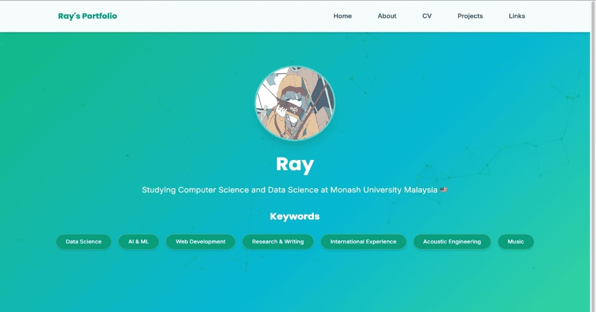

# ポートフォリオ ウェブサイト テンプレート

[](https://opensource.org/licenses/MIT)
[](https://nodejs.org/)
[](http://makeapullrequest.com)

**[🇬🇧 English README is here](README.md)**

---

バニラHTML、CSS、JavaScriptで構築されたクリーンでレスポンシブなポートフォリオテンプレート。
**無料で使用可能** - フォーク、カスタマイズして、あなただけのものにしてください！

**🌟 [ライブデモ](https://rayramy04.github.io/portfolio/index.html)** | **📄 [MIT ライセンス](LICENSE)**


*全デバイスに最適化されたクリーンでモダンなデザイン*

## 🎯 こんな方におすすめ
- 初めてポートフォリオを作る学生
- クリーンでプロフェッショナルなサイトが欲しい開発者
- 高速でカスタマイズ可能なポートフォリオが必要な方

## ✨ 主な機能

- **🔧 データ駆動型** - シンプルなJavaScriptファイルでコンテンツを編集、HTMLの編集不要
- **🎨 カスタマイズ可能** - 簡単な色テーマ設定、レスポンシブデザイン
- **📱 モバイルファースト** - 全デバイスで美しく表示
- **🔍 SEO最適化** - 構造化データとメタタグを含む
- **📄 レジュメダウンロード** - PDFを自動検出してダウンロードボタンを表示
- **🍴 フォーク対応** - カスタマイズを失わずに上流の更新を同期
- **🚀 依存関係ゼロ** - 純粋なHTML/CSS/JS、どこでも動作

## 📋 必要要件

- **Node.js 15.0.0+** (`generate-pages.js` の実行に必要)
- モダンなウェブブラウザ (Chrome 60+, Firefox 60+, Safari 12+, Edge 79+)
- Git (クローンとバージョン管理用)

## 🚀 クイックスタート

```bash
# 1. GitHubでこのリポジトリをフォーク

# 2. フォークをクローン
git clone https://github.com/YOUR-USERNAME/portfolio.git
cd portfolio

# 3. データファイルを編集 (下の「カスタマイズする項目」を参照)
vim data/seo-config.js    # あなたの名前、URL、メタタグ
vim data/about.js         # あなたのストーリー
vim data/cv.js            # あなたの経験
vim data/projects.js      # あなたのプロジェクト

# 4. HTMLページを再生成
node generate-pages.js

# 5. ローカルでテスト
python -m http.server 8000  # http://localhost:8000 を開く

# 6. GitHub Pages / Netlify / Vercel にデプロイ
git add . && git commit -m "chore: personalize portfolio" && git push
```

## 🍴 フォーク＆同期ワークフロー

このテンプレートは**フォーク対応** - カスタマイズを失わずに上流の更新を同期できます。

### 仕組み

**保護されるファイル** (あなたのもの、上書きされません):
- `data/**` - あなたのコンテンツ
- `css/palette.css` - あなたのカラー
- `robots.txt` - あなたのSEO設定
- `assets/**` - あなたの画像
- `resume/**` - あなたのレジュメPDF
- `content/**` - 生成されたコンテンツHTML

**自動同期されるファイル** (テンプレートロジック):
- `generate-pages.js`, `template-base.html`, `css/style.css`, `js/**`

### 更新を同期するには

```bash
# GitHubの「Sync fork」ボタンをクリック - あなたのデータは安全です！
```

これは `.gitattributes` で `merge=ours` 戦略により設定されています。

## 📝 カスタマイズする項目

**これらを編集** (あなたのコンテンツ、更新から保護されます):

| カテゴリ | ファイル | 変更内容 |
|----------|-------|----------------|
| **個人情報とSEO** | `data/seo-config.js` | 名前、URL、メタディスクリプション、SNSリンク |
| **ページコンテンツ** | `data/*.js` | About、CV、Projects、Links、ホームページ |
| **ビジュアルテーマ** | `css/palette.css` | ブランドカラー |
| **メディアアセット** | `assets/**` | プロフィール写真、プロジェクト画像 |
| **レジュメファイル** | `resume/**` | `resume-ja.pdf`, `resume-en.pdf` (任意) |
| **検索設定** | `robots.txt` | 公開/非公開の表示設定 (下記参照) |

**これらは編集しないでください** (テンプレートロジック、自動同期されます):
- `generate-pages.js`, `template-base.html`, `css/style.css`, `js/**`

## 🔍 検索エンジンの表示設定

あなたのポートフォリオをGoogle/Bingの検索結果に表示するかどうかを選択できます:

**公開 (デフォルト)** - ほとんどのユーザーに推奨:
```bash
cp robots.txt.public robots.txt
```

**非公開** - 直接リンク経由でのみアクセス可能:
```bash
cp robots.txt.private robots.txt
```

## 📁 プロジェクト構造

```
portfolio/
├── data/                   # ← これらのファイルを編集
│   ├── seo-config.js      #    名前、URL、メタタグ
│   ├── about.js           #    あなたのストーリー
│   ├── cv.js              #    経験とスキル
│   ├── projects.js        #    あなたのプロジェクト
│   ├── links.js           #    連絡先情報
│   └── ...
├── assets/                # ← あなたの画像に置き換え
├── css/
│   └── palette.css        # ← ここで色をカスタマイズ
├── generate-pages.js      # ← HTML再生成のために実行
├── *.html                 # 生成されたページ
└── ...                    # テンプレートファイル (編集しない)
```

## 🎨 カスタマイズの例

### 色の変更

`css/palette.css` を編集:
```css
:root {
  --color-primary: #059669;     /* これをあなたのブランドカラーに変更 */
  --color-primary-light: #34d399;
  --color-primary-dark: #047857;
}
```

### プロジェクトの追加

`data/projects.js` を編集:
```javascript
{
    name: "新しいプロジェクト",
    description: "プロジェクトの説明",
    categories: ["Web Development", "AI"],
    githubUrl: "https://github.com/username/project",
    image: "assets/projects/my-project.jpg"
}
```

### 職務経験の追加

`data/cv.js` を編集:
```javascript
{
    company: "会社名",
    position: "職種",
    period: "2024.01 - Present",
    description: "あなたが行ったことと達成したこと"
}
```

すべてのコンテンツはJavaScriptデータファイルで管理されます - HTMLの編集は不要です！

### レジュメダウンロードの追加

`resume/` フォルダーを作成してレジュメPDFを追加:
```bash
mkdir resume
# レジュメファイルを追加:
# - resume-ja.pdf (日本語)
# - resume-en.pdf (英語)
```

ファイルが検出されると、ホームページとCVページに自動的にダウンロードボタンが表示されます。機能：
- `resume/` フォルダー内のPDFファイルを自動検出
- ファイルが存在する場合のみボタンを表示
- 日本語レジュメを左側、英語レジュメを右側に表示
- サイト全体と統一されたアニメーションとスタイル

### サイトマップの生成

サイトマップはSEO設定から自動生成されます:

```bash
node generate-pages.js  # 正しいURLでsitemap.xmlを生成
```

サイトマップは `data/seo-config.js` の `baseUrl` を使用し、すべてのページを適切な優先度と変更頻度で含みます。

## 🚀 デプロイ

**GitHub Pages:**
1. GitHubにプッシュ → Settings → Pages → 有効化
2. ソースを `main` ブランチに設定

**その他のプラットフォーム:** Netlify、Vercel、任意の静的ホスティング - ファイルをアップロードするだけ！

💡 デプロイ後は、`data/seo-config.js` のURLを更新することを忘れずに。

## 🐛 トラブルシューティング

**画像が表示されない？** `data/` ファイル内のファイルパスが `assets/` フォルダと一致しているか確認してください。

**ページが更新されない？** データファイル編集後に `node generate-pages.js` を実行してください。

**ヘルプが必要？** GitHubでissueを開いてください。

## 🤝 貢献

改善の提案を歓迎します！

1. リポジトリをフォーク
2. 機能ブランチを作成 (`git checkout -b feature/AmazingFeature`)
3. 変更をコミット (`git commit -m 'Add some AmazingFeature'`)
4. ブランチにプッシュ (`git push origin feature/AmazingFeature`)
5. プルリクエストを開く

**注意:** これはテンプレートプロジェクトです。貢献する際は:
- 個人データではなく、テンプレートロジックの改善に焦点を当ててください
- 変更が `.gitattributes` のマージ戦略で動作することを確認してください
- 新機能を追加する場合はドキュメントを更新してください
- 両方の `data/seo-config.js` バリエーションでテストしてください

## 📄 ライセンス

MIT ライセンス - 個人利用・商用利用ともに無料です。

## 🙏 謝辞

このテンプレートは以下のオープンソースリソースを使用しています:

- [Font Awesome](https://fontawesome.com/) - アイコンライブラリ
- [Google Fonts](https://fonts.google.com/) - Poppins & Inter 書体
- [Particles.js](https://vincentgarreau.com/particles.js/) - インタラクティブな背景アニメーション
- [Schema.org](https://schema.org/) - 構造化データ標準

---

**テンプレートバージョン**: 1.2
**必要環境**: Node.js 15.0+ | ES6+とCSS Gridをサポートするモダンブラウザ
